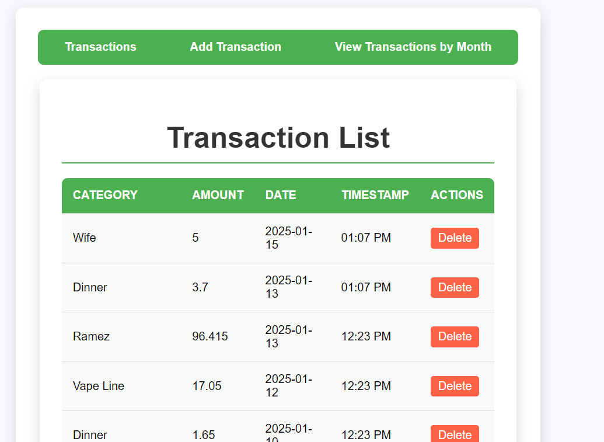
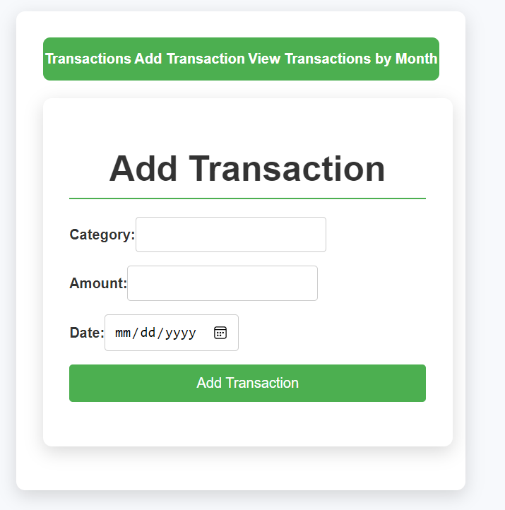
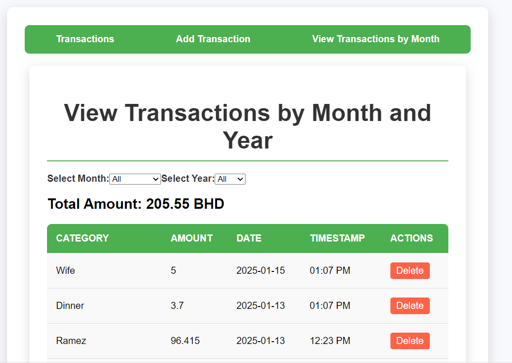

# Finance Manager Flask App

Finance Manager is a web application built with Flask that allows users to manage their finances by adding, viewing, and deleting transactions. Users can view transactions by month and year, and calculate the total amount for all transactions or for a specific month.

## Features

- Add new transactions
- View all transactions
- Delete transactions
- View transactions by month and year
- Calculate total for all transactions
- Calculate total for a specific month

## Usage

- To add a new transaction, navigate to the "Add Transaction" page, fill in the details, and submit the form.
- To view all transactions, navigate to the "View Transactions" page.
- To delete a transaction, click the "Delete" button next to the transaction you wish to remove.
- To view transactions by month and year, select the desired month and year from the dropdown menus on the "View Transactions" page.
- To calculate the total amount for all transactions or for a specific month, use the "Calculate Total" feature on the "View Transactions" page.

## License

This project is licensed under the MIT License. See the [LICENSE](LICENSE) file for details.

## Contributing

Contributions are welcome! Please open an issue or submit a pull request if you have any improvements or bug fixes.

Enjoy managing your finances with Finance Manager!

## Screenshots

